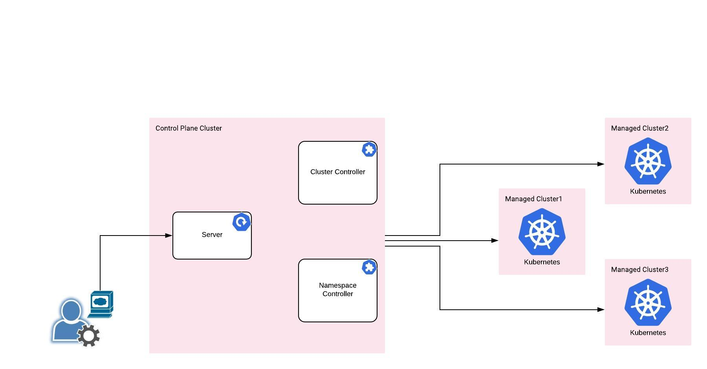

# manager

### What is keiko manager?
keiko manager provides the capability of managing all the target clusters from the central control plane cluster. In the phase 1 of the project, we are going to concentrate on Namespace Management followed by other features like RBAC, Monitoring and consolidated view of all the clusters in a single pane.

### Background

At Intuit, we manage around 170+ clusters (at the time of writing this page) and around 7000 namespaces. We know the pain of managing the namespaces when it comes to very large number of namespaces and we have an internal product which shows the consolidated view for managing all the clusters and namespaces.   
As part of Kubecon 2019 demo, there are lot of companies interested in that internal product and we are launching this effort to open source some of the modules with our learnings in managing very large number of clusters and namespaces.   
This effort mainly focuses on managing namespaces as there are many open source and vendor products are already available to manage the clusters with variety of options including clusters in AWS, GCP and on-premise. 

### Status
This project is in initial stage and actively being worked on. Apart from what is being mentioned here, if you are interested to see any other features feel free to create the issues and as always we welcome contributions with open arms.

### High Level Design

## ❤ Contributing ❤

Please see [CONTRIBUTING.md](.github/CONTRIBUTING.md).

## Developer Guide

Please see [DEVELOPER.md](.github/DEVELOPER.md).

<!-- Markdown link -->
[install]: docs/README.md
[ext_link]: https://upload.wikimedia.org/wikipedia/commons/d/d9/VisualEditor_-_Icon_-_External-link.svg

[GithubMaintainedUrl]: https://github.com/keikoproj/manager/graphs/commit-activity
[GithubPrsUrl]: https://github.com/keikoproj/manager/pulls
[SlackUrl]: https://keikoproj.slack.com/messages/manager

[BuildStatusImg]: https://travis-ci.org/keikoproj/manager.svg?branch=master
[BuildMasterUrl]: https://travis-ci.org/keikoproj/manager

[CodecovImg]: https://codecov.io/gh/keikoproj/manager/branch/master/graph/badge.svg
[CodecovUrl]: https://codecov.io/gh/keikoproj/manager

[GoReportImg]: https://goreportcard.com/badge/github.com/keikoproj/manager
[GoReportUrl]: https://goreportcard.com/report/github.com/keikoproj/manager

